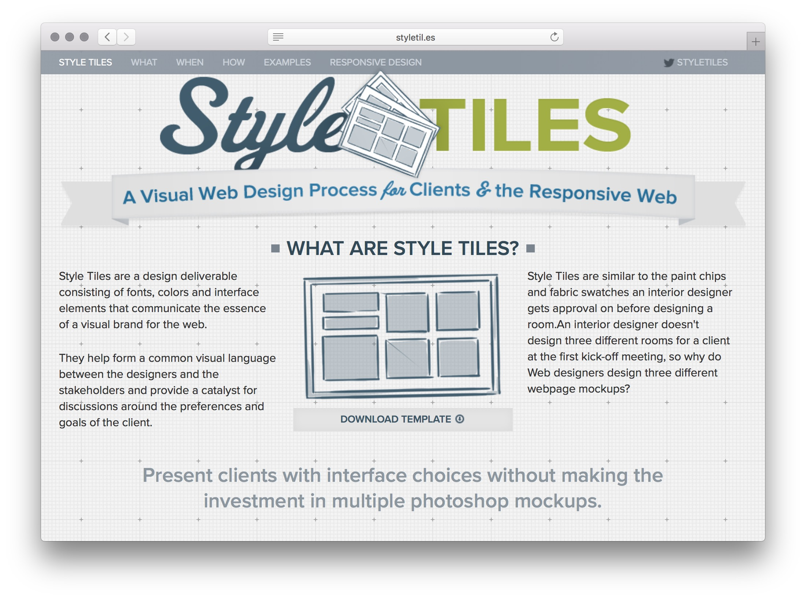
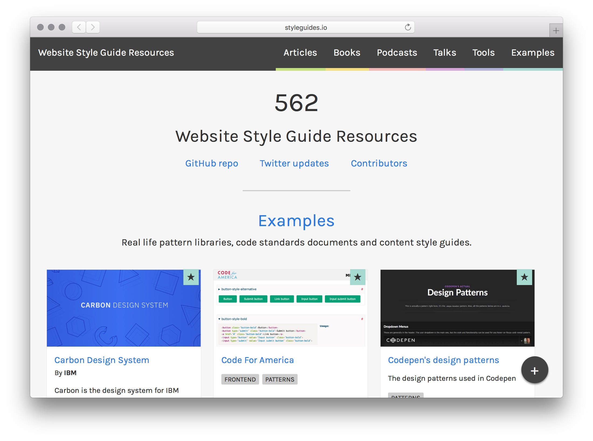

## Outils:

### Moodboards

### Style Tiles

> [Style tiles are] a catalyst for discussions around the preferences and goals of the client." – Samantha Warren

[http://styletil.es/](http://styletil.es/)

Ethan Marcotte refers to static comps during the responsive design process as a “catalog of assumptions” 

*Style Tiles* are the perfect complement to that catalog, whether it be in place of comps or to reinforce visual themes. Style Tiles don't imply dimensions nor device; only that the design will be digital.

"Style Tiles are a design deliverable consisting of fonts, colors and interface elements that communicate the essence of a visual brand for the web."

Samantha Warren: [Style Tiles as a Web Design Process Tool](http://badassideas.com/style-tiles-as-a-web-design-process-tool/) (2011)

> "I use the style tile as a starting point to discover if the client’s visual translation of descriptive words and mine are similar. I ask questions that provoke rich answers with lots of adjectives. Tons of adjectives give me great material for kicking off my style tile."

A style tile is a visual “tray” of paint chips, fabric patterns, and color choices that support the client’s goals. I have a Photoshop template with specifically masked areas where, rather than showing paint chips, I display samples of button styles, navigational treatments, and typographic possibilities.

Throughout my design career I have had the opportunity to present comps, mood boards, and style tiles, and I have found that it is really important to use the right tool for the job. 

**Mood boards** work great for startup clients or opportunities where you are designing an identity to go along with a website and you have very limited budgets. It’s great for discovery and brainstorming; distilling big picture feelings and ideas into more clearly defined visuals.

And a **comp** combines all of the research and analysis behind a wireframe and layout with style, and this can be a very difficult thing for a non-designer to understand.

The entire process of layout and user experience discovery can be halted because of color, pattern, or application.  

While they definitely influence each together, separating the two discovery processes allows for iterative progress to be going on simultaneously.

### Element Collages

> My version of Style Tiles integrates my love of collaging for a different type of execution I call an “Element Collage.” That particular phrase creates an expectation that what we’re looking at isn’t a final design but rather an assembly of disparate pieces without specific logic or order. – [Dan Mall](http://v3.danielmall.com/articles/rif-element-collages/) (2012)

This format represents how I begin to think about designing a site. I often have ideas for pieces of a site in bursts. A full comp often requires ideas to be fully realized. An element collage allows me to document a thought at any state of realization and move on to the next. 

Exemples:

- https://www.aztekweb.com/blog/post/dan-mall-and-element-collages-to-the-rescue/
- https://cloudfour.com/thinks/element-collages-are-fun/
- https://www.amazeelabs.com/en/blog/element-collage
- https://blog.wsol.com/using-element-collages-to-improve-the-design-process

- Visual Inventory

http://v3.danielmall.com/articles/visual-inventory/

## Le mouvement des "design systems"

Les préoccupations du web design vers 2010 étaient focalisées sur les principes du "[Responsive Web Design](https://cours-web.ch/css/responsive)" et du "Mobile First". On constate que dès 2015, parmi les sujets les plus discutés figurent les "Styles Guides" et "Design Systems".

Quelques étapes-clé dans cette évolution du discours:

- Avril 2014, Susan Robertson publie l'article [*Creating Style Guides*](http://alistapart.com/article/creating-style-guides) sur A List Apart.
- Fin 2014, Brad Frost [annonce](http://bradfrost.com/blog/post/styleguides-io/) le lancement de [styleguides.io](http://styleguides.io/). Ce site collecte quelques 200 exemples de "style guides" de compagnies publiés sur le web, et héberge le Style Guide Podcast.

- En 2015, Brad Frost [annonce](http://bradfrost.com/blog/post/atomic-design-book/) son projet de livre "Atomic Design".
- En mars 2016, la première conférence [Clarity Conf](https://www.clarityconf.com/2016) ("a conference about style guides and design systems") se tient à San Francisco. Parmi les orateurs, Brad Frost, des gens de Salesforce, Dropbox, GitHub, Slack...
- En avril 2016, les designers d'Airbnb publient [plusieurs](https://airbnb.design/the-way-we-build/) [articles](https://airbnb.design/building-a-visual-language/) sur la refonte de leur "Design Language System".!

[Articles de Airbnb](img/airbnb/airbnb-design-blog.jpg)

- Novembre 2016: sortie du livre "Atomic Design", auto-publié par Brad Frost.
- Octobre 2017: sortie du livre "[Design Systems](https://www.smashingmagazine.com/design-systems-book/)", par Alla Kholmatova, publié par Smashing Books.
- Début 2018, Figma lance une série de "design system meetups" dans six villes (Lagos, Toronto, Bangalore, Amsterdam, New York, Los Angeles). 
- En mars 2018, la première [Design Systems Conference](https://dsconference.com/) a lieu à Helsinki. Parmi les conférenciers, des designers de chez IBM, Airbnb...

### Style Guides

> Pour moi, un "style guide" est un document de code tenu à jour, qui détaille tous les éléments et modules de code de votre site ou application. – Susan Robertson, Creating Style Guides

Utilitaires pour aider à générer des "style guides" CSS pour un site web:

- [X-rayHTML](https://github.com/filamentgroup/X-rayHTML), par l'agence Filament Group
- [KSS (Knyle Style Sheets)](http://warpspire.com/kss/)
- [Hologram](http://trulia.github.io/hologram/)
- [Pattern Lab](https://patternlab.io/), par Brad Frost

Des outils comme KSS analysent le CSS du projet pour générer automatiquement le "style guide".

Exemple de Style Guide produit avec KSS: [WordCamp Style Guide](https://lucijanblagonic.github.io/wceu-2017/styleguide/), guide des styles CSS pour le site de la conférence WordCamp Europe 2017.

### Pattern Library

> I think it’s safe to say a Pattern Library isn’t necessary for every project. But if your site, application, or network of content suffers from style collisions, repeated code, and lack of cohesive UX then a Pattern Library is probably a helpful tool to have. – Dave Rupert, [What I Know About Pattern Libraries](https://daverupert.com/2017/06/what-i-know-about-pattern-libraries/)

### Pattern Lab

### Design Systems

> The generally-accepted definition of a **design system** is that it’s the outer circle—it encompasses pattern libraries, style guides, and any other artefacts. But there’s something more. Just because you have a collection of design patterns doesn’t mean you have a design *system*. A system is a framework. It’s a rulebook. It’s what tells you *how* those patterns work together. - [Jeremy Keith](https://adactio.com/journal/13844), mai 2018

#### Exemples de "Design Systems" publiés par des compagnies:

- [The Lightning Design System](https://www.lightningdesignsystem.com/), par Salesforce.
- [GOV.UK Elements](https://design-system.service.gov.uk), le Design System du gouvernement britannique. 
- [Primer CSS](http://primercss.io/), "the design system that powers GitHub".
- [IBM Design Language](https://www.ibm.com/design/language/)
- IBM: [Carbon Design System](http://carbondesignsystem.com/), "the design system for IBM Cloud products".
- Microsoft: [Fluent Design Language](https://fluent.microsoft.com/)

Articles et conférences qui décrivent ces systèmes:

- *[The Way We Build](https://airbnb.design/the-way-we-build/)*, par Alex Schleifer, avril 2016. Sur le développement d'un *Design Language System* chez Airbnb.
- *[Building a Visual Language](https://airbnb.design/building-a-visual-language/)*, par Karri Saarinen, mai 2016. Suite du précédent.
- *[Carbon: Designing inside Big Blue](https://medium.com/design-ibm/carbon-designing-inside-big-blue-8577883cfe42)*, par Bethany Sonefeld, mars 2017. Sur le système *Carbon* utilisé chez IBM.
- *[Scaling Great Design Across A Fortune 10 Company](https://bigmedium.com/projects/unity-design-system-exxonmobil.html)*, par Josh Clark, avril 2017. Sur le développement d'un "enterprise design system" pour ExxonMobil.
- *[Painting with Code](https://airbnb.design/painting-with-code/)*, par Jon Gold, avril 2017: annonce le lancement par Airbnb de "React-sketchapp", une librairie open-source permettant de générer des composantes Sketch.
- *[The User Experience of Design Systems](https://runemadsen.com/talks/uxcampcph/)*, par Rune Madsen, conférence donnée à UX Camp Copenhagen, mai 2017.
- *[Design Systems are for People](https://publication.design.systems/design-systems-are-for-people-a484620b6988)*, par Jina Anne, octobre 2017.
- *[Building the GOV.UK Design System](https://gds.blog.gov.uk/2017/10/30/building-the-gov-uk-design-system/)*, par Alice Noakes et Tim Paul, octobre 2017. Sur la création d'un système de design pour le gouvernement britannique.
- [Design Systems at Gusto](https://robinrendle.com/notes/design-systems-at-gusto/), par Robin Rendle. Décrit les erreurs fréquentes dans la mise en place d'un système de design, et quatre règles pour les éviter.

Outils publiés par des compagnies:

- [Pattern Lab](https://patternlab.io/) - outil créé par Brad Frost (auteur de Atomic Design).
- [Fractal](https://fractal.build/) - "a tool to help you build and document web component libraries". Outil créé par l'agence Clearleft, basé sur Node.js.

Exemples historiques:

- [Snow White design language](https://en.wikipedia.org/wiki/Snow_White_design_language), créé par l'agence Frog, utilisé de 1984 à 1990 pour les ordinateurs Apple.